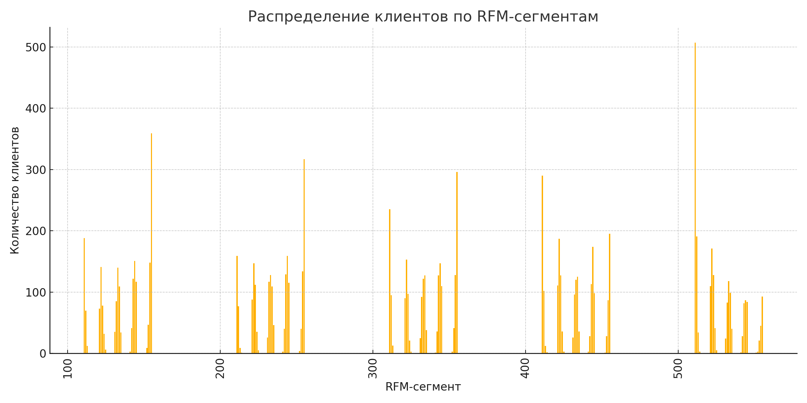

# rfm-analysis-ozon
Анализ клиентской базы маркетплейса Ozon методом RFM
# 🛒 RFM-анализ клиентов Ozon

## Описание проекта

В этом проекте я провела RFM-анализ клиентской базы интернет-магазина Ozon.  
Цель — понять, как покупатели ведут себя, выделить ключевые сегменты и сформулировать гипотезы для маркетинга и удержания клиентов.

Проект реализован на данных, приближённых к реальным: структура заказов, клиенты, категории товаров. Все расчёты сделаны с помощью SQL в DBeaver, визуализация — в Excel.

---

## Цель анализа

- Разбить клиентов на сегменты по их активности и ценности для бизнеса
- Оценить вклад разных групп в общую выручку
- Подумать, как можно использовать эти данные для роста продаж

---

## Что такое RFM

RFM-анализ — это способ сегментации клиентов по трем метрикам:
- **Recency** — как давно клиент делал последнюю покупку
- **Frequency** — как часто он покупает
- **Monetary** — сколько он тратит

Каждому клиенту присваивается балл от 1 до 5 по каждой метрике, после чего формируется итоговый сегмент, например `555`, `211`, `343` и т.д.

---

## Результаты

- Сегмент `555` — это наиболее ценные клиенты. Они покупают часто, недавно и тратят много. Их немного (около 10%), но они дают почти половину всей выручки.
- Сегмент `111` — "спящие" клиенты, давно не покупали и почти ничего не тратят. Их много, но с точки зрения бизнеса они малополезны.
- Есть интересный сегмент `155` — клиенты, которые тратили много, но давно не заходили. Их стоит попробовать вернуть через персональные предложения.
- Основная масса клиентов находится в средних сегментах (`344`, `434`, и т.д.) — с ними можно работать на удержание.

---

## Визуализация

### 📊 Топ RFM-сегментов по численности клиентов

### Распределение клиентов по RFM-сегментам

### Сегменты по выручке
_(можно добавить ещё один график здесь, если сделаешь)_

---

## Технологии

- SQL (SQLite, DBeaver)
- Excel (для визуализации)
- GitHub (документация и хранение проекта)

---

## Файлы проекта

- `/sql/rfm_analysis.sql` — все SQL-запросы
- `/img/` — графики из Excel
- `/data/` — фрагмент исходного датасета (опционально)

---

## Автор

Проект выполнен в рамках подготовки портфолио аналитика.  
Если есть вопросы — с радостью отвечу!

Оперативно связаться со мной можно в телеграм - @ban_any

